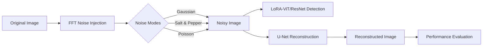

# Adversarial Attack & Reconstruction in Face Landmark Detection 🛡️🎭

[](https://www.python.org/downloads/release/python-390/)
[](https://pytorch.org/get-started/locally/)
[](https://huggingface.co/docs/peft/index)
[](https://opensource.org/licenses/MIT)

This repository implements a robust **Face Landmark Detection** system (5-point: nose, eyes, mouth) using **ResNet-18** and **Vision Transformer (ViT)** backbones. It explores the intersection of **Privacy-Preserving AI** and **Adversarial Robustness** by analyzing model performance under frequency-domain noise attacks and subsequent U-Net-based reconstruction.

---

## 🌟 Key Highlights

*   **PEFT with LoRA**: Efficient fine-tuning of Large Vision Models (ViT) using **LoRA (Low-Rank Adaptation)** adapters, achieving high accuracy with minimal parameter updates.
*   **Adversarial Noise Analysis**: Systematic evaluation of Gaussian, Salt-and-Pepper, and Poisson noise injected via **Fast Fourier Transform (FFT)**.
*   **Privacy-Preserving Reconstruction**: Implementation of a **U-Net** architecture to "attack" (reconstruct) noisy images, evaluating the trade-off between human recognizability and machine-learning utility.

---

## 🧬 System Architecture



---

## 🛠 Installation & Prerequisites

### Setup Environment
```bash
pip install -r requirements.txt
```

### Dlib Installation (Legacy Support)
If `conda install` fails for **dlib**, ensure you have **Visual Studio Build Tools (C++)** and **CMake** installed:
```bash
pip install cmake
pip install dlib
```

---

## 🚀 Usage Guide

### 1. Baseline Training (with LoRA)
Train the backbone models with Parameter-Efficient Fine-Tuning:
```bash
# ViT with LoRA
python train.py --backbone vit --epochs 30 --batch_size 32 --lr 1e-4 --use_lora --lora_r 8 --lora_alpha 16
```

### 2. Adversarial Noise Injection
Test noise effects on your dataset:
```bash
python utils/add_noise.py --modes gaussian salt_pepper poisson --test
```
*Adjust `--radius` (FFT Low-pass), `--sigma` (Gaussian), or `--photon-lambda` (Poisson) to tune attack intensity.*


### 3. Attack & Reconstruction (U-Net)
Train the encoder-decoder network to reconstruct clean images:
```bash
python attack_model.py --clean-csv data/landmarks_dataset.csv --noisy-csv data/landmarks_dataset_salt_pepper.csv --noise-tag salt_pepper --save-dir attack_checkpoints
```


---

## 📊 Experimental Results

| Model | Baseline (Clean) | Gaussian Noise | Reconstructed |
| :--- | :---: | :---: | :---: |
| **ResNet-18** | High | Low | Moderate |
| **ViT + LoRA** | **Highest** | **Moderate** | **High** |


---

## 📧 Contact & Citation
Developed by **YiPeng Chen**.
- **Email**: yipeng003@e.ntu.edu.sg
- **GitHub**: [Chenypovo](https://github.com/Chenypovo)

---
*If you find this work useful, please consider giving it a ⭐!*
