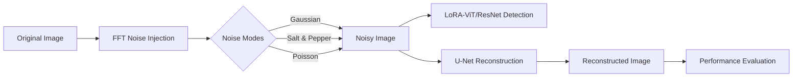

# Adversarial Attack & Reconstruction in Face Landmark Detection 🛡️

**Privacy-preserving AI with adversarial robustness analysis**

This project implements face landmark detection (5-point: nose, eyes, mouth) using ResNet-18 and Vision Transformer backbones, with PEFT-LoRA fine-tuning and adversarial noise analysis.

---

## 🌟 Key Features

- **PEFT with LoRA**: Efficient fine-tuning of ViT using Low-Rank Adaptation adapters
- **Adversarial Noise Analysis**: Systematic evaluation of Gaussian, Salt-and-Pepper, and Poisson noise via FFT
- **Privacy-Preserving Reconstruction**: U-Net architecture for image reconstruction under noise attacks

---

## 🏗️ Architecture



---

## 🛠 Installation

```bash
# Clone the repo
git clone https://github.com/Chenypovo/face_recognition_and_privacy_perserving.git
cd face_recognition_and_privacy_perserving

# Install dependencies
pip install -r requirements.txt
```

### Dlib Installation (if needed)
```bash
pip install cmake
pip install dlib
```

---

## 🚀 Usage

### Baseline Training (with LoRA)
```bash
# ViT with LoRA
python train.py --backbone vit --epochs 30 --batch_size 32 --lr 1e-4 --use_lora --lora_r 8 --lora_alpha 16
```

### Adversarial Noise Injection
```bash
python utils/add_noise.py --modes gaussian salt_pepper poisson --test
```

### Attack & Reconstruction (U-Net)
```bash
python attack_model.py --clean-csv data/landmarks_dataset.csv --noisy-csv data/landmarks_dataset_salt_pepper.csv --noise-tag salt_pepper --save-dir attack_checkpoints
```

---

## 📂 Project Structure

*   `train.py`: Baseline training with LoRA support
*   `attack_model.py`: U-Net reconstruction training
*   `utils/add_noise.py`: FFT-based noise injection
*   `data/`: Dataset and CSV files
*   `attack_checkpoints/`: Saved model weights

---

## 📧 Contact

Developed by **YiPeng Chen**.
- **Email**: yipeng003@e.ntu.edu.sg
- **GitHub**: [Chenypovo](https://github.com/Chenypovo)

---

## 📄 License

MIT License
